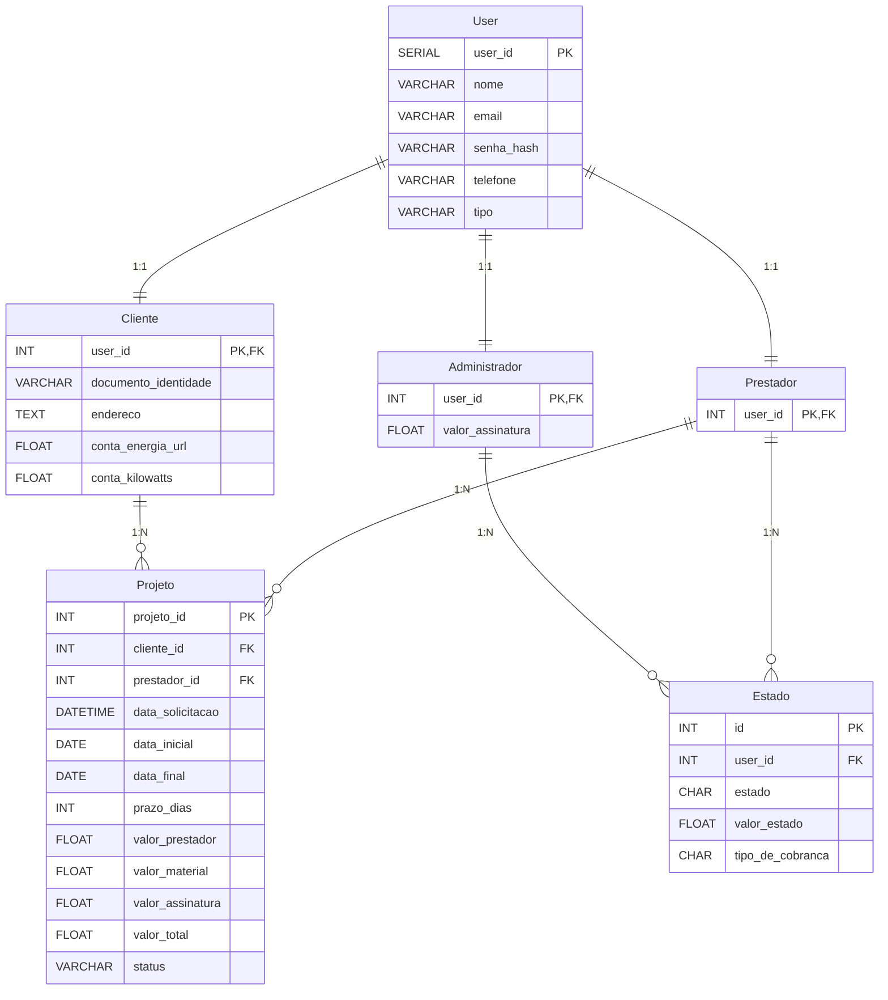

# Diagrama ER

```mermaid
    erDiagram
        User {
            SERIAL user_id PK
            VARCHAR nome
            VARCHAR email
            VARCHAR senha_hash
            VARCHAR telefone
            VARCHAR tipo
        }

        Administrador {
            INT user_id PK, FK
            FLOAT valor_assinatura
        }

        Cliente {
            INT user_id PK, FK
            VARCHAR documento_identidade
            TEXT endereco
            FLOAT conta_energia_url
            FLOAT conta_kilowatts
        }

        Prestador {
            INT user_id PK, FK
        }

        Estado {
            INT id PK
            INT user_id FK
            CHAR estado
            FLOAT valor_estado
            CHAR tipo_de_cobranca
        }

        Projeto {
            INT projeto_id PK
            INT cliente_id FK
            INT prestador_id FK
            DATETIME data_solicitacao
            DATE data_inicial
            DATE data_final
            INT prazo_dias
            FLOAT valor_prestador
            FLOAT valor_material
            FLOAT valor_assinatura
            FLOAT valor_total
            VARCHAR status
        }

        User ||--|| Cliente : "1:1"
        User ||--|| Prestador : "1:1"
        User ||--|| Administrador : "1:1"
        Administrador ||--o{ Estado : "1:N"
        Prestador ||--o{ Estado : "1:N"
        Cliente ||--o{ Projeto : "1:N"
        Prestador ||--o{ Projeto : "1:N"
```
